# Proyecto_MachineLearning
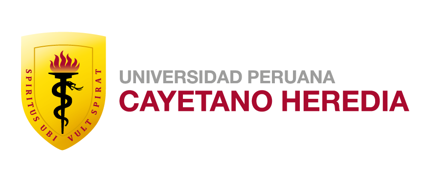
> Facultad de Ciencias e Ingeniería
>
# Segmentación de imágenes biomédicas
>
# Aplicación de U-net en Imágenes de Cancer Gastrointestinal - HyperKvasir
>
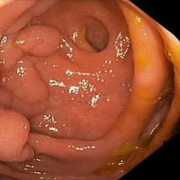
>
> Integrantes
>
> Josue Eduardo Huarauya Fabian
>
> Alexandra Nancy Lima Quispe
>
> Vanesa Nelsy Morales Taipe
>
> Nohereily Kimberly Salazar Berrios
>
> Gilmar Rony Oviedo Chahua
>
> Asesor
>
> Ing. Jesús Paucar Escalante
>
> 8 de julio de 2023

1\. Problemática

La detección temprana y el tratamiento del cáncer gastrointestinal son
desafíos críticos en la medicina moderna. El cáncer de estómago es una
enfermedad mul-tifactorial que puede ser influida tanto por factores
genéticos como ambientales. A nivel mundial, según el GLOBOCAN 2020
(Sung y cols. 2021), el cáncer de estómago causó aproximadamente 800 000
muertes lo que representa el 7,7% de todas las muertes y se encuentra en
el cuarto lugar entre las principales causas de muerte por cáncer. En
2020 se diagnosticaron alrededor de 1,1 millones de nuevos casos de
cáncer de estómago, lo que representa el 5,6% de todos los casos de
cáncer (ver figura 1).
>
>
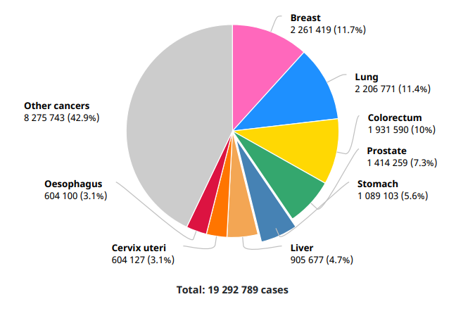

> Figura 1: Número de casos nuevos en 2020, ambos sexos, todas las
> edades (Globocan 2020b)

En Perú, según el Observatorio Global del Cáncer (Globocan 2020a)
informó 6,300 casos en el año 2020 (ver figura 2). Los factores de
riesgo de este tipo de cáncer en Perú incluyen el consumo excesivo de
sal, embutidos, alcohol, tabaco y la bacteria helicobacter pylori que
afecta mayormente a las personas de bajos recursos, ya que esta está
asociada con la enfermedad gastritis atrófica. Asimismo, se observa una
mayor tasa de 17 casos por cada 100 000 habitantes en hombres que en
mujeres (Globocan 2020a). Sin embargo, considerando los 33 millones de
habitantes, actualmente tenemos 871 patólogos clínicos y 9 patólogos
oncológicos según el registro nacional de especialistas del Colegio Médico del Perú
(CMP 2023). En el 2021, se registraron 252 patólogos clínicos y 1
patólogo oncológico que laboraron en el MINSA (MINSA 2021). Cabe
resaltar, que el principal método de diagnóstico es la endoscopia que
tiene un costo de S/.370, además, tiene una duración de 15 a 30 minutos,
pero los resultados son entregados a partir de una semana a más
dependiendo a diversos factores como la lista de espera, políticas del
centro médico, cantidad de especialistas,etc.

Además, esta herramienta de diagnóstico tiene ventajas y desventajas en
cuanto a la detección, que son los siguientes:

Ventajas:

\- Permite una visualización directa del interior del tracto
gastrointestinal, lo que puede ayudar a obtener un diagnóstico preciso
de diversas afecciones.

-Puede utilizarse no solo para fines diagnósticos, sino también para
realizar tra-tamientos en un solo procedimiento en algunos casos.

-Es un procedimiento muy seguro con un bajo riesgo de complicaciones

Desventajas:

\- Algunos pacientes pueden experimentar incomodidad o ansiedad durante
el pro-cedimiento debido a la necesidad de tragar el endoscopio o a la
sedación.

\- Existe la posibilidad de complicaciones como perforación, hemorragia
o reaccio-nes a los medicamentos utilizados para la sedación.

\- Puede ser necesario seguir una dieta específica o tomar laxantes
antes del pro-cedimiento para limpiar el tracto gastrointestinal.

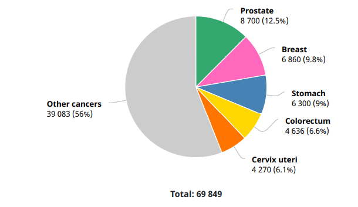

> Figura 2:
>Número de casos nuevos en 2020, ambos sexos, todas las edades (Globocan
2020a)

Por otra parte, en México, este tipo de cáncer se ubica entre las diez
principales causas de muerte (Martinez-Carrillo, Arzeta Camero, y
Jimenez-Wences 2021). Según datos de 2018, se registraron 3,921 casos en
hombres, lo que representa el 4.6% de todos los casos de cáncer
diagnosticados en ese año. En etapas tempranas este tipo de cáncer es
tratable, pero en etapas avanzadas se reduce a meses de sobrevida. Es
recomendable realizarse un diagnóstico a través de una endoscopia y
magnificación de imágenes a partir de los 40 años de edad.

2\. Estado de arte

Existen estudios realizados a través de la clasificación y segmentación
de imá-genes, uno de ellas es "Detección automatizada de cáncer gástrico
mediante un conjunto de datos de imágenes endoscópicas retrospectivas
utilizando U-Net R-CNN\"(Teramoto y cols. 2021), que utilizó 1208
imágenes de sujetos sanos y 533 imágenes de pacientes con cáncer
gástrico en el que se presentó un nuevo enfo-que llamado U-Net R-CNN,
que utiliza un modelo de aprendizaje profundo. Este modelo combina el
proceso de segmentación de U-Net con una CNN para la cla-sificación de
imágenes, con el objetivo de reducir los falsos positivos. Al utilizar
DenseNet169 como una red neuronal convolucional para la clasificación de
las cajas, se mostró una sensibilidad de detección del 0.98 y un número
de falsos po-sitivos evaluados por lesión de 0,01 por imagen. Estos
resultados representan una mejora en el rendimiento de detección en
comparación con el método anterior.

Otro estudio titulado "Detección y caracterización del cáncer gástrico
utilizando el modelo de aprendizaje profundo en cascada en imágenes
endoscópicas" (Tera-moto y cols. 2022), menciona la herramienta U-net
para la segmentación de las imágenes, asimismo, esta presenta un
resultado por medio del coeficiente Dice y Jaccard de 0.55 para imágenes
de cáncer en la etapa temprana y 0.716 en eta-pa avanzada. Pero hubo
deficiencias al momento de segmentar, ya que muchas imágenes se tomaron
desde el costado de la pared gástrica en vez de tomarlas desde el
frente. Asimismo, el estudio \"Detección y segmentación automatizadas de
cáncer gástrico temprano a partir de imágenes endoscópicas usando
máscara R-CNN\"(Jäger, Mokos, Prasianakis, y Leyer 2022), recolectó 1208
imágenes sa-nas y 533 de cáncer, donde se generó un cuadro delimitador y
una imagen con etiquetas para identificar la región afectada por el
cáncer gástrico ya que, con una validación cruzada con cinco
repeticiones, se obtuvo una sensibilidad de 0.96 y una tasa de falsos
positivos de 0.10 FP por imagen. En cuanto a la evaluación de la
segmentación de la región del cáncer gástrico, se obtuvo un índice de
Dice promedio del 0.71. Estos resultados sugieren que el enfoque es
efectivo para la detección automatizada de cáncer gástrico en etapas
tempranas durante los pro-cedimientos de endoscopia.

3\. Estrategia de solución

Nuestra propuesta de solución es aplicar el método U-Net, ya que ha
demostrado ser muy efectivo en la segmentación. Aplicaremos esta
herramienta con el objetivo de segmentar imágenes del cáncer de
estómago, el cual nos permitirá tener una segmentación precisa y
eficiente, reduciendo el margen de error. Como resultado, podremos tener
una detección temprana de este tipo de cáncer y contrarrestarlo lo antes
posible.

La propuesta de solución tendrá la siguiente estructura:

3.1.- Preparación de los datos: Antes de aplicar la segmentación,
tenemos que tener un conjunto de datos de imágenes de estómago listo
para el entrenamiento y la validación. Esto puede implicar la
recopilación de imágenes. En este caso, presentamos 1000 imágenes
segmentadas con su máscara correspondiente a la clase de pólipos
gástricos.

3.2.- Preprocesamiento de los datos: Una vez que tenemos los datos, el
siguiente paso es procesarlos. Esto se aplica en la corrección de
iluminación, la eliminación de ruido y el ajuste del tamaño de las
imágenes para que todas tengan las mismas dimensiones.

3.3.- Implementación del modelo U-Net: Esta arquitectura combina los
be-neficios del U-Net, que es especialmente bueno en la captura de
detalles finos y la segmentación precisa de imágenes.

3.4.- Entrenamiento del modelo: Una vez que establecemos la estructura
del modelo U-Net, le proporcionamos un conjunto de 1000 imágenes
segmentadas con su máscara correspondiente a la clase de pólipos
gástricos, dichas imágenes repre-sentarán nuestro conjunto de
entrenamiento. El objetivo es que el modelo aprenda a identificar las
regiones con cáncer en estas imágenes. Durante este entrenamien-to, el
modelo se autoajusta para cometer menos errores en la identificación del
cáncer.

3.5.- Validación y pruebas del modelo: Una vez entrenado nuestro modelo
U-Net, debemos probar su efectividad usando un conjunto de datos
inédito, cono-cido como "conjunto de prueba". Este paso, llamado
validación y pruebas, verifica que el modelo no solo memorizó los datos
de entrenamiento, sino que aprendió a generalizar, es decir, a aplicar
lo aprendido para identificar correctamente el cáncer de estómago en
imágenes nuevas y desconocidas. Este proceso es crucial para garantizar
la precisión y la fiabilidad del modelo antes de su aplicación en
situaciones del mundo real.

4\. Caracterización del dataset

El conjunto de datos HyperKvasir, recopilado en el Hospital Bærum en
Noruega, representa el conjunto de datos más extenso en términos de
imágenes y vídeos del sistema gastrointestinal (Borgli y cols. 2020).
Este consta de 110,079 imáge-nes y 374 videos, fue recopilado durante
procedimientos reales de gastroscopia y colonoscopia. HyperKvasir
incluye representaciones de hallazgos normales y pa-tológicos, así como
puntos de referencia anatómicos. Algunas de las imágenes y videos tienen
una pequeña imagen verde en la esquina inferior izquierda, que es una
representación del Olympus ScopeGuide TM, una herramienta utilizada por
el endoscopista para obtener una vista topográfica del colon. El tamaño
total del conjunto de datos es de aproximadamente 66.4 GB, sin contar
los archivos de me-tadatos y las máscaras de segmentación, con 32.5 GB
correspondientes a videos y 33.9 GB a imágenes. La tabla 1 ofrece un
resumen de todos los registros de datos presentes en el conjunto. El
resultado es más de 1,1 millones de imágenes y cuadros de video en
total.

A su vez, este conjunto se divide en cuatro categorías distintas:
imágenes etique-tadas, imágenes sin etiquetar, imágenes segmentadas y
videos etiquetados. En la Figura 3 se presentan todas las diferentes
categorías etiquetadas, que se dividen en 16 clases correspondientes al
tracto gastrointestinal superior (Figura 3a) y 24 clases relacionadas
con el tracto gastrointestinal inferior (Figura 3b).

En total, se tienen 10,662 imágenes etiquetadas, almacenadas en formato
JPEG y organizadas en carpetas según su clase (por ejemplo, pólipos,
esófago de Barrett, etc.). Este conjunto presenta un desafío debido a la
distribución desequilibrada de las clases, reflejando la frecuencia
variable de ciertos hallazgos médicos.Las imáge-nes etiquetadas
contienen 23 categorías distintas de descubrimientos o hallazgos (ver
tabla 2).

Además, se incluyen 99,417 imágenes sin etiquetar, alojadas en una
subcarpe-ta dentro de la carpeta de imágenes. Además de las imágenes, se
proporcionan funciones globales y asignaciones de clústeres en el
repositorio de Hyper-Kvasir Github en formato ARFF, que se pueden
procesar con herramientas como WEKA o convertir en archivos CSV.

Asimismo, se proporcionan 1000 imágenes segmentadas de la clase de
pólipos todas con su correspondiente máscara de segmentación, dichas
máscaras señalan el tejido del pólipo representado en blanco, mientras,
que el fondo es negro. Estas están almacenadas en una carpeta de 57 MB
con dimensiones entre 600 x 500 píxeles en su mayoría y cada cuadro
delimitador abarca los píxeles más externos del pólipo. Los cuadros
delimitadores asociados se guardan en un archivo JSON. Tanto las
imágenes como las máscaras comparten el mismo nombre de archivo y se
encuentran en la carpeta de imágenes segmentadas.

Finalmente, el conjunto de datos contiene 374 videos de endoscopia
gastrointesti-nal. Estos videos suman 9,78 horas y 889 372 fotogramas,
que se pueden convertir en imágenes si es necesario. Un gastroenterólogo
experimentado identificó 30 cla-ses de hallazgos en los videos (ver
figura 4), que se organizan según el tracto gastrointestinal superior o
inferior y las cuatro categorías principales: pólipos, cáncer,
inflamación y otros (ver figura 5).

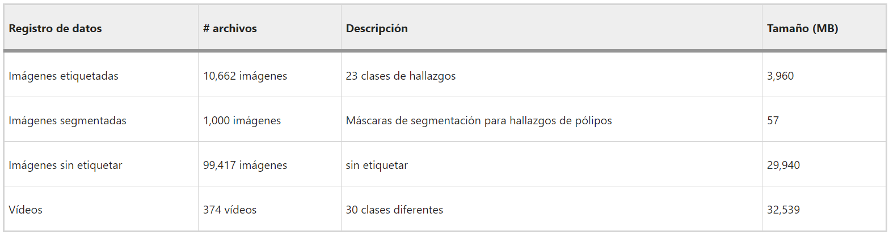

Cuadro 1: Descripción general de los registros de datos en el conjunto
de datos de HyperKvasir (Borgli y cols. 2020).

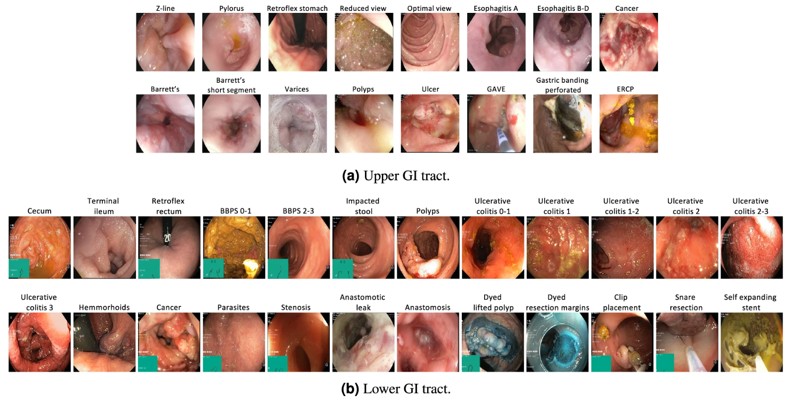

Figura 3: Ejemplos de imágenes de las diversas clases etiquetadas para
imágenes y/o videos (Borgli y cols. 2020).

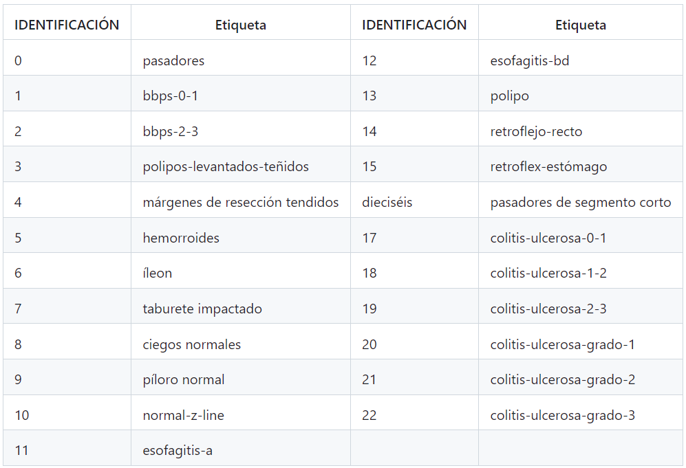

Cuadro 2: Hyper-Kvasir incluye las siguientes etiquetas de imagen para
la parte etiquetada del conjunto de datos (Borgli y cols. 2020).

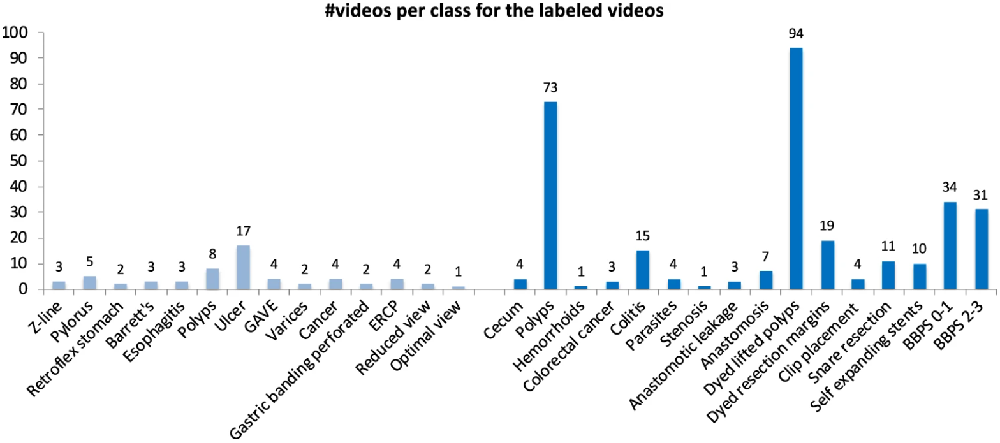

Figura 4: La cantidad de videos en las diversas clases de video
etiquetadas de HyperKvasir según las carpetas de archivos (Borgli y
cols. 2020).

Ingeniería Informática ix

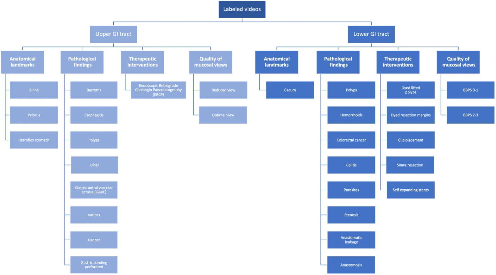{width="6.692917760279965in"
height="3.7159142607174105in"}

UPCH

Figura 5:

> Proyecto de Machine Learning

Las diversas clases de video estructuradas en posición y tipo, que
también es la estructura

de las carpetas de video (Borgli y cols. 2020).

5\. Metodología

5.1.- Preprocesamiento de los datos: Para el preprocesamiento de datos,
pri-mero encuentra la región negra identificando los píxeles negros en
la imagen en escala de grises pero escoge la que tiene el área más
grande en la imagen.Luego, muestra la imagen original con esta región
resaltada y recorta la imagen vertical-mente con su respectiva máscara
alrededor de esta región. Finalmente, se descarga. De esta forma, se
aplica para las 1000 imágenes, después, se hace el respectivo
escalamiento que será de tamaño (256 x 256) píxeles.

5.2.- Implementación del modelo U-Net: Para implementar el modelo U-Net
para la segmentación de imágenes, primero se define la arquitectura de
la red uti-lizando capas convolucionales(CNN), capas de agrupación y
capas de convolución transpuesta. Luego, se compila el modelo
especificando la función de pérdida, el optimizador y las métricas a
utilizar durante el entrenamiento. También se pue-de definir un conjunto
de datos personalizado para cargar imágenes y máscaras desde los
directorios especificados y escalarlas al tamaño deseado. Para evaluar
el rendimiento del modelo, se puede utilizar el coeficiente de dados
(Sørensen-Dice). Durante la evaluación, el modelo se cambia al modo de
evaluación y se procesan

Ingeniería Informática x

UPCH Proyecto de Machine
Learning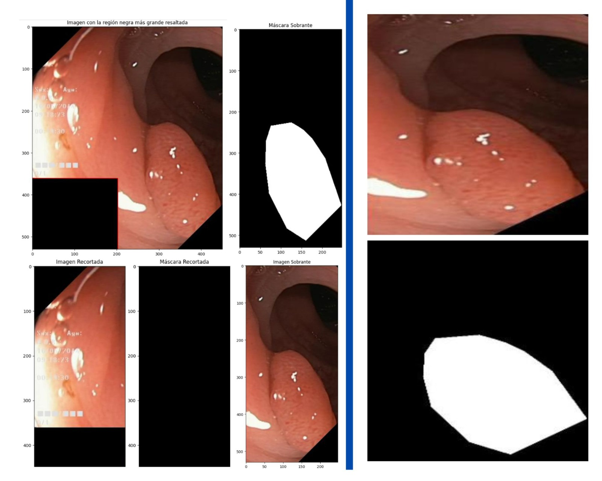{width="4.015777559055118in"
height="3.2126213910761154in"}

las imagenes. Se calcula la predicción del modelo
y se compara con la máscara verdadera utilizando el Sørensen-Dice.
Finalmente, se devuelve el promedio del Sørensen-Dice sobre todas las imagenes. También es posible calcular el gradiente del Sørensen-Dice
durante el entrenamiento si es necesario (ver figura 6).

> Figura 6: Proceso de recorte y escalamiento respectivamente.

5.3.- Entrenamiento del modelo: Para entrenar un modelo U-Net para
seg-mentar imágenes, se definen varios parámetros, como la escala de
imagen, el por-centaje de datos de validación, el tamaño de imagen, la
tasa de aprendizaje y el número de épocas. Luego, se cargan los datos de
imagen y máscara desde los directorios especificados y se dividen en
conjuntos de entrenamiento y validación. Después, se define el modelo
U-Net y se mueve al dispositivo especificado (en este caso, una GPU).
También se define el optimizador y el programador de tasa de aprendizaje
a utilizar durante el entrenamiento. Finalmente, se entrena el modelo
durante el número especificado de épocas. En cada época, se procesan los
datos de imágenes y se calcula la pérdida utilizando la función de
pérdida especifica-da. Luego, se actualizan los parámetros del modelo
utilizando el optimizador y se monitorea el rendimiento del modelo en el
conjunto de validación. También se registra la pérdida de entrenamiento
y la puntuación de validación para cada época. Durante el entrenamiento
del modelo U-Net, se ajustan los parámetros del modelo para minimizar la
función de pérdida que mide qué tan bien el modelo se ajusta a los datos
de entrenamiento. En este caso, se ajustó el entrenamiento en

Ingeniería Informática xi

UPCH Proyecto de Machine
Learning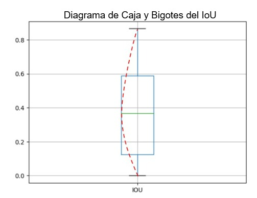{width="5.354365704286964in"
height="4.130205599300088in"}

100 épocas, 10−4 para la tasa de aprendizaje, 1.0 que es la escala de
las imágenes, 0.3 representa el porcentaje de datos de validación, 64
muestras que se procesarán simultáneamente y 2 subprocesos. Después de
1100 iteraciones, el modelo U-Net tuvo una pérdida de entrenamiento de
3.476 con los parámetros mencionados. Asimismo, tuvo una puntuación de
validación de 0.004.

6\. Resultados

El valor del coeficiente IoU es 0.368, lo que indica que la intersección
entre la máscara predicha y la máscara verdadera es aproximadamente
36.8% en relación con la unión entre ambas máscaras. En otras palabras,
la máscara predicha y la máscara verdadera tienen una superposición del
36.8% en relación con su área total combinada. Cabe resaltar, que este
resultado de la métrica IoU es la media de todas imágenes validadas, lo
cual según la gráfica de caja y bigotes se puede observar un sesgo hacia
la derecha que significa que la mayoría de los datos se encuentran en
valores más superiores a la media (ver figura 7).

> Figura 7: Representación de la gráfica de caja y bigote del
> coeficiente de IoU

Además, el valor de Sørensen-Dice 0.480 indica que hay un grado moderado
a alto

Ingeniería Informática xii

UPCH Proyecto de Machine
Learning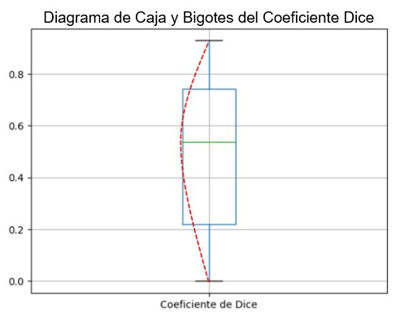{width="5.354258530183727in"
height="4.200698818897638in"}

de similitud entre la máscara predicha y la máscara verdadera que
representa el 48% de similitud. Cabe recalcar, que este resultado de la
métrica Dice es la media de todas imágenes validadas, lo cual según la
gráfica de caja y bigotes se puede observar un sesgo hacia la izquierda
por lo que se infiere que la mayoría de los datos se encuentran en
valores más bajos que la media (ver figura 8).

> Figura 8: Representación de la gráfica de caja y bigote de
> Sørensen-Dice

A continuación, se muestra una imagen con ambos resultados de las
métricas, así como su segmentación.

Ingeniería Informática xiii

UPCH Proyecto de Machine
Learning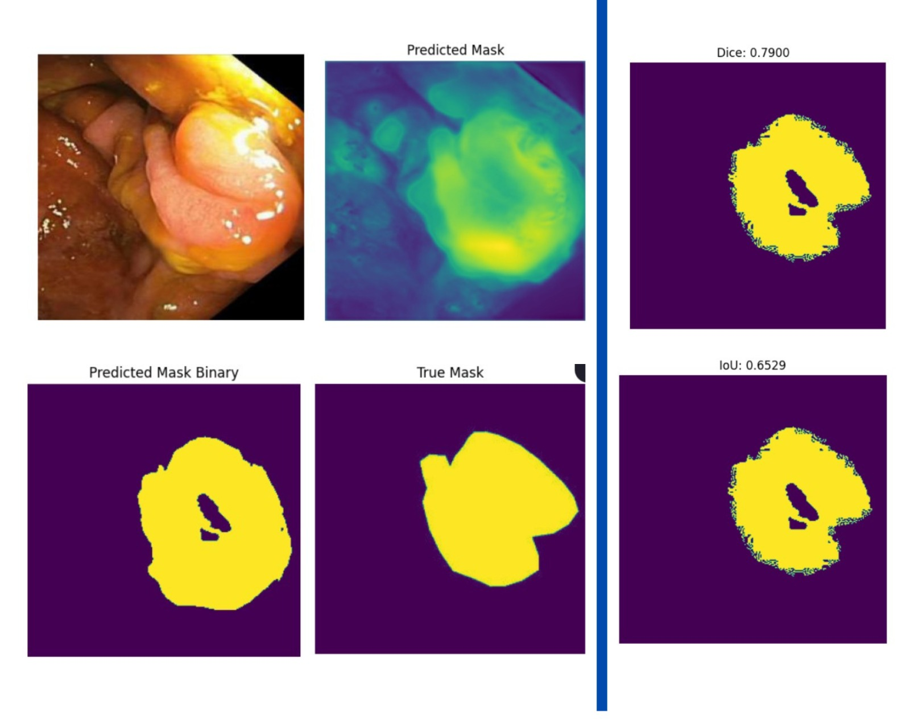{width="5.3542224409448815in"
height="4.283377077865267in"}

Figura 9: Proceso de la segmentación por el modelo U-Net y sus
respectivos resultados de las métricas Sørensen-Dice y IoU.

Un valor de Sørensen-Dice de 79%, indica una buena coincidencia entre la
segmen-tación predicha y la segmentación verdadera. Un valor de IoU de
65%, también indica una buena coincidencia, aunque un poco más baja que
el valor de Sørensen-Dice. En general, cuanto más cerca estén estos
valores AL 100%, mejor será el rendimiento del modelo de segmentación de
imágenes.

7\. Discusión

Se implementó y entrenó un modelo U-Net para la segmentación de
imágenes. Después de 1100 iteraciones, el modelo tuvo una pérdida de
entrenamiento de 3.476 y una puntuación de validación de 0.004. Según
los resultados de la gráfica de la función de pérdida podemos observar
que el modelo está aprendiendo cuando la curva desciende (ver figura
10). Además, se calcularon los valores del coeficiente IoU y
Sørensen-Dice para evaluar el rendimiento del modelo en la segmentación
de imágenes con un umbral de -0.5. Si la métrica IoU tiene valores que
se encuentren por encima del 0.5, siendo esta la similitud entre la
imagen segmentada y la

Ingeniería Informática xiv

UPCH Proyecto de Machine
Learning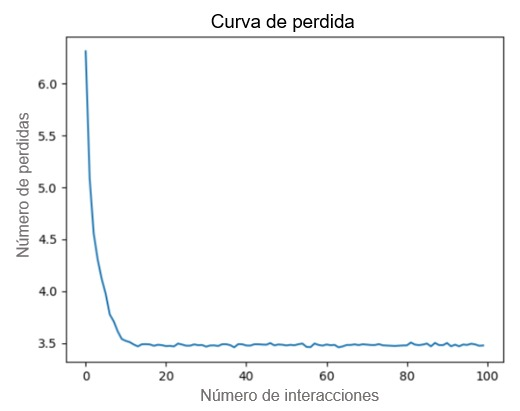{width="6.693048993875766in"
height="5.290083114610674in"}

máscara, por lo cual sé puede decir que es considerada como una buena
predicción. Aunque cuando está más cerca a 1 mayor será la similitud
(Monasterio Expósito y cols. 2018). De la misma forma sucede con la
métrica Sørensen-Dice que tiene valores que oscilan entre 0 y 1 (Salazar
2000).

Aunque el valor del coeficiente IoU y Sørensen-Dice indican que hay una
superpo-sición y similitud moderadas entre la máscara predicha y la
máscara verdadera, se esperaba que el modelo tuviera un rendimiento
mayor. Hay varias razones por las que el rendimiento del modelo podría
no ser tan alto como se esperaba. Por ejemplo, podría ser necesario
ajustar los parámetros del modelo o utilizar una ar-quitectura de red
diferente para mejorar el rendimiento. También podría ser útil utilizar
más datos de entrenamiento o aplicar técnicas de aumento de datos para
mejorar la capacidad del modelo para generalizar a nuevos datos.

> Figura 10: Curva de Perdida

Ingeniería Informática xv

UPCH Proyecto de Machine Learning

8\. Conclusión

En este caso, se implementó y entrenó un modelo U-Net para la
segmentación de imágenes. Aunque el modelo mostró cierto grado de
superposición y similitud entre la máscara predicha y la máscara
verdadera, su rendimiento no fue tan alto como se esperaba. Debido al
recorte vertical que se realizó a las 1000 imágenes, lo cual provocó
gran pérdida de información en algunas imágenes. Por ello, se obtuvo el
resultado que se menciona en los párrafos anteriores y en la figura
anterior (ver figura 10).

En el futuro, se recomienda realizar recortes en las imágenes de manera
horizontal y vertical sin perder la información de esta. También, podría
ser útil explorar diferentes arquitecturas de red, ajustar los
parámetros del modelo como el umbral, el número de épocas y taza de
aprendizaje. Además, se recomienda utilizar más datosde
entrenamientopara mejorarel rendimiento del modelo enla segmentación de
imágenes.

> Referencias
>
> Borgli, H., Thambawita, V., Smedsrud, P. H., Hicks, S., Jha, D.,
> Eskeland, S. L., \... de Lange, T. (2020). HyperKvasir, a
> comprehensive multi-class image and video dataset for gastrointestinal
> endoscopy. Scientific Data, 7(1), 283. Descargado de
> <https://doi.org/10.1038/s41597-020-00622-y> doi:
> 10.1038/s41597-020-00622-y
>
> CMP. (2023). Especialistas en patologia en perú. Descargado de
> [https://www](https://www.cmp.org.pe/conoce-a-tu-medico/)
> [.cmp.org.pe/conoce-a-tu-medico/](https://www.cmp.org.pe/conoce-a-tu-medico/)
>
> Globocan. (2020a). Datos estadisticos de casos nuevos de cancer en
> perú. Descargado de
> [https://gco.iarc.fr/today/data/factsheets/](https://gco.iarc.fr/today/data/factsheets/populations/604-peru-fact-sheets.pdf)
> [populations/604-peru-fact-sheets.pdf](https://gco.iarc.fr/today/data/factsheets/populations/604-peru-fact-sheets.pdf)
>
> Globocan. (2020b). Datos estadisticos mundial de cancer al estomago.
> Des-cargado de
> [https://gco.iarc.fr/today/data/factsheets/cancers/7](https://gco.iarc.fr/today/data/factsheets/cancers/7-Stomach-fact-sheet.pdf)
> [-Stomach-fact-sheet.pdf](https://gco.iarc.fr/today/data/factsheets/cancers/7-Stomach-fact-sheet.pdf)
>
> Jäger, T., Mokos, A., Prasianakis, N. I., y Leyer, S. (2022).
> first_page settings order article reprints open accessarticle
> pore-level multiphase simulations of realistic distillation membranes
> for water desalination. Membranes.
>
> Martinez-Carrillo, D. N., Arzeta Camero, V., y Jimenez-Wences, H. e.
> a. (2021).

Ingeniería Informática xvi

UPCH Proyecto de Machine Learning

> Cáncer de estómago: factores de riesgo, diagnóstico y tratamiento.
>
> MINSA. (2021). Compendio estadístico: Información de recursos humanos
> del sector salud perú 2013 - 2021. Descargado de
> [http://bvs.minsa.gob.pe/](http://bvs.minsa.gob.pe/local/MINSA/5883.pdf)
> [local/MINSA/5883.pdf](http://bvs.minsa.gob.pe/local/MINSA/5883.pdf)
>
> Monasterio Expósito, L., y cols. (2018). Técnicas de segmentación
> semántica aplicadas en imágenes de laparoscopia.
>
> Salazar, M. E. R. (2000). Coeficientes de asociación. Plaza y Valdes.
>
> Sung, H., Ferlay, J., Siegel, R., Laversanne, M., Soerjomataram, I.,
> Jemal, A., y Bray, F. (2021). Global cancer statistics 2020: Globocan
> estimates of inci-dence and mortality worldwide for 36 cancers in 185
> countries. CA: a Cancer Journal for Clinicians, 71(3), 209--249.
>
> Teramoto, A., Shibata, T., Yamada, H., Hirooka, Y., Saito, K., y
> Fujita, H. (2021). Automated detection of gastric cancer by
> retrospective endoscopic image dataset using u-net r-cnn. Applied
> Sciences, 11(23), 11275.
>
> Teramoto, A., Shibata, T., Yamada, H., Hirooka, Y., Saito, K., y
> Fujita, H. (2022). Detection and characterization of gastric cancer
> using cascade deep learning model in endoscopic images. Diagnostics,
> 12(8), 1996.

Ingeniería Informática xvii
